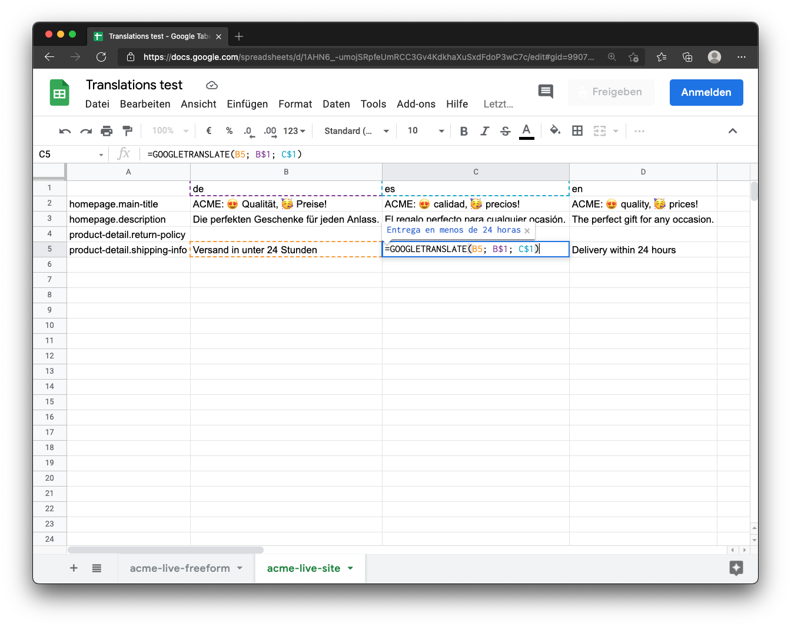
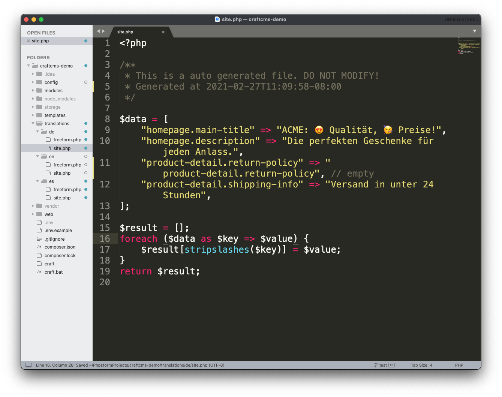
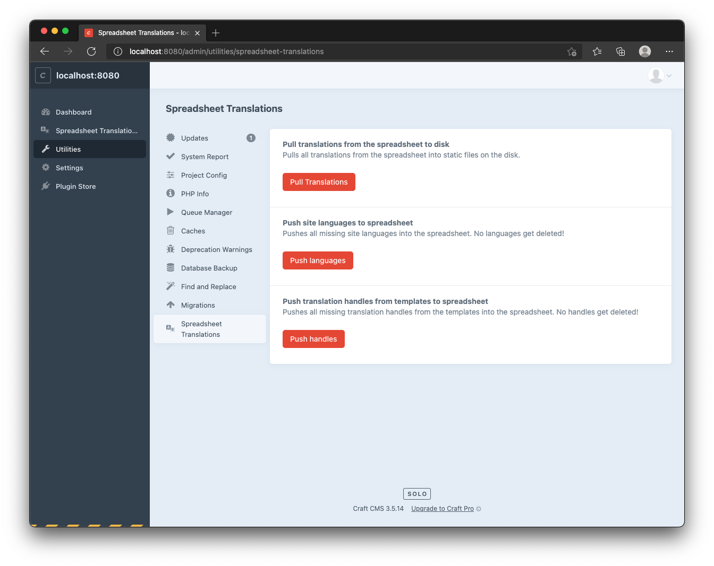
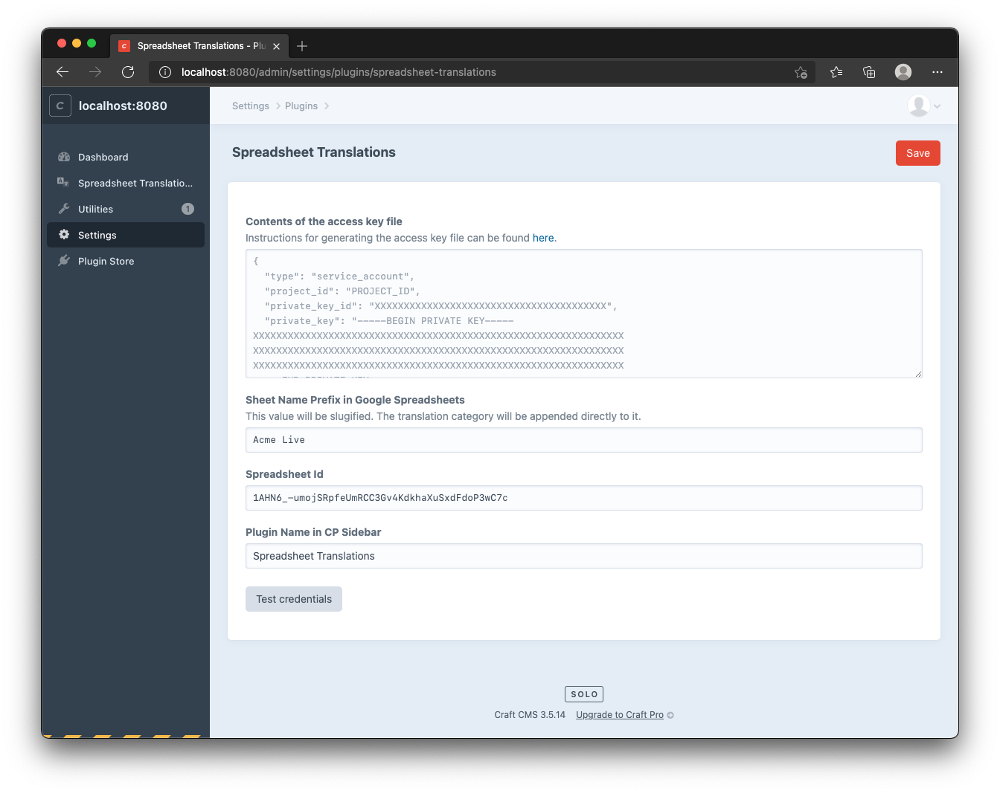

# Spreadsheet Translations plugin for Craft CMS 3.x

This plugin enables non-developers to access static translations via a Google spreadsheet.


## Screenshots






## Requirements
This plugin requires Craft CMS 3.1.0 or later.

## Installation
To install this plugin, follow these steps:

1. Install with Composer via `internetztube/craft-spreadsheet-translations`
2. Install plugin in the Craft Control Panel under Settings > Plugins
You can also install this plugin via the Plugin Store in the Craft Control Panel.

## Issues
Please report any issues you find to the [Issues](https://github.com/internetztube/craft-spreadsheet-translations/issues) page.

## Dynamic Strings
* You CANNOT translate dynamic strings. Please use the [message parameter](https://docs.craftcms.com/v3/static-translations.html#provide-the-translations). 
    ```
    {{ ("Welcome back, " ~ currentUser.friendlyName ~ "!") | t }}
    ```
    ```
    {{ 'Welcome back, {name}!' | t(params = { name: currentUser.friendlyName}) }}
    ```
    
## Console Utilities
* Pulls all translations from the spreadsheet into static files on the disk. No handles get deleted!
    ```
    php craft spreadsheet-translations/main/pull-translations
    ```
* Pushes all missing translation handles from the templates into the spreadsheet. No handles get deleted!
    ```
    php craft spreadsheet-translations/main/push-missing-handles
    ```
* Pushes all missing site languages into the spreadsheet. No languages get deleted!
    ```
    php craft spreadsheet-translations/main/push-missing-languages
    ```

_These utilities are also available in the control panel in the Utilities section._

## Setup / Settings

### Google API
For this plugin a Google API token is mandatory. Here you will be shown how to create one.

1. Go to [https://console.developers.google.com/apis/library/sheets.googleapis.com](https://console.developers.google.com/apis/library/sheets.googleapis.com).
2. Click `ENABLE`.
3. Click `Credentials` in the sidebar.
4. Click `Create Credentials` and then select `Service account key`.
5. Click `Select...` and create a new Service account _or_ use an existing Service account.
6. Just fill in a name and an eMail prefix. You will need the eMail address in a further step.  
7. Keep `JSON` as Key type.
8. Click `Create`.
9. This Service account DOES NOT need a special role. So click `CREATE WITHOUT ROLE` in the modal.
10. A JSON file had been downloaded. The contents of this file must be copied to the `Contents of the access key file`-field in the plugin's settings.
11. Go to your Spreadsheet and share it with the eMail Address of the Service account.

### Google Spreadsheets

In addition to the `Contents of the access key file`, the `Spreadsheet Id` and the `Sheet Name where the Translations are located` is required in the settings.

#### Spreadsheet Id
The Spreadsheet Id is just a part of the URL. 
```
https://docs.google.com/spreadsheets/d/<SPREADSHEET-ID>/edit
```

`https://docs.google.com/spreadsheets/d/11fRj44MwhGqFGpIYHGfwpA69ed-Z657WdiXex6kvuo8/edit` -> `11fRj44MwhGqFGpIYHGfwpA69ed-Z657WdiXex6kvuo8`

#### Sheet Name
This is the name of the sheet, where the translations are stored, which should be applied for this project. This string gets slugified. `DEV: Translations` -> `dev-translations`.

---
Brought to you by [Frederic Köberl](https://github.com/internetztube)
